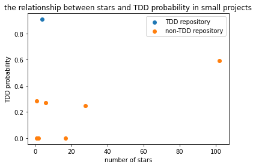

2 of repositories in the control group are ignored because they don't have test files. Therefore we only use 28 repositories in the analysis.

1. Inspect likelihood for a project to be TDD over all projects?
 
 After calculation, the number of TDD repositories is 8 and they are  ['sling-org-apache-sling-fsresource' 'ignite-3' 'oozie' 'iotdb'
 'tapestry-5' 'incubator-hop' 'cxf' 'asterixdb-hyracks']
 
 the likelihood for a project to be TDD over all repositories is 0.2857142857142857

2. Inspect likelihood for each size of project to be TDD?

the likelihood for small project to be TDD is 0.125

the likelihood for medium project to be TDD is 0.4

the likelihood for large project to be TDD is 0.3

3. Inspect popularity for TDD vs non-TDD projects over all repos

 Draw a scatter diagram to show the relationship between stars and TDD probability.

4. Inspect popularity for TDD vs non-TDD projects for each sized project.

 Similar to RQ3, and we will draw scatter diagram for each size of projects.
 
 
 
 
 
 

5. How TDD impacts the commit size and the number of bug-fixing commits?
 
 - How TDD impacts the commit size
 Use a for loop to calculate the average modified lines in each commit (`Modified Lines / Commits Numbers`). And then, draw two histograms for TDD and non-TDD repositories separately.
 
 
 
 
 
 
 - How TDD impacts the number of bug-fixing commits
 Use a for loop to calculate the persentage of bug-fixing commits in a repository (`Bug Fixing Commits Number / Commits Numbers`). And then, draw two histograms for TDD and non-TDD repositories separately.
 
 
 
 
